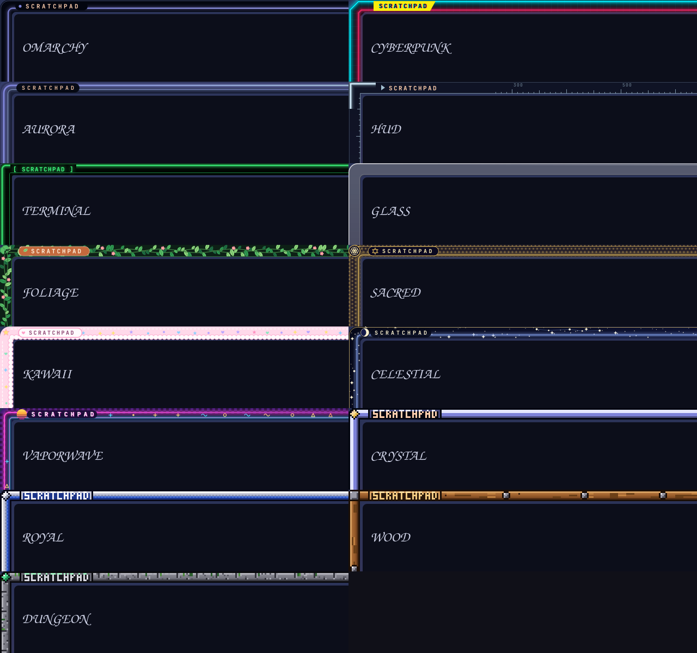
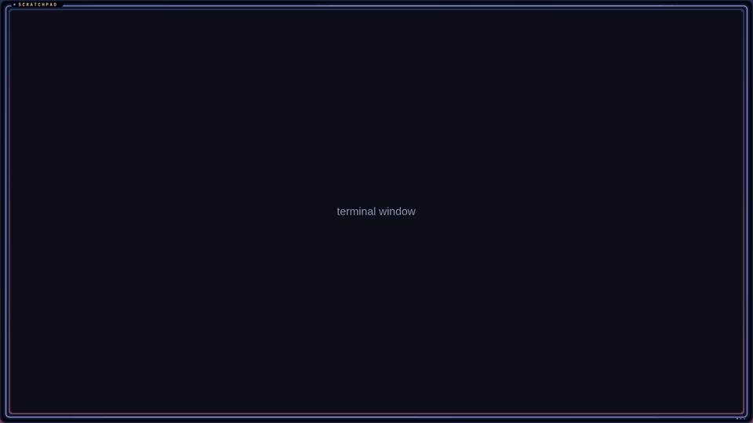
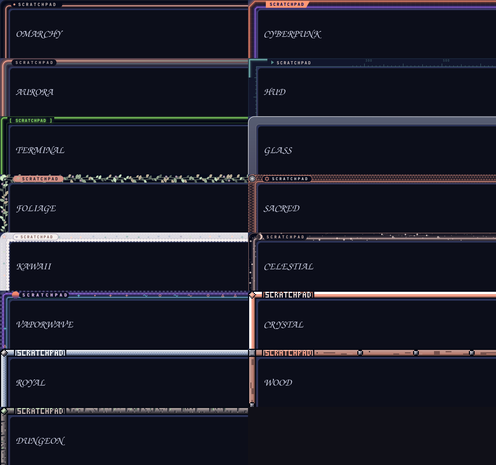

# Scratchpad Frame

A frame around the Omarchy scratchpad (`SUPER + S`). The frame slides in and out together with the scratchpad.





Twenty-four styles. The smooth, anti-aliased vector ones:

| Style | Look |
| --- | --- |
| **Omarchy** | clean accent line, rounded, name pill, pager dots |
| **Cyberpunk** | chamfered neon cyan + magenta, circuit traces, hazard stripe, yellow tab |
| **Aurora** | soft glowing gradient ring |
| **HUD** | corner brackets, ruler ticks, coordinates, status readout |
| **Terminal** | phosphor-green double line, scanlines, prompt and cursor |
| **Glass** | frosted translucent bezel with a specular edge |
| **Foliage** | 16-bit jungle: layered pixel-art vines, flowers and elephant-ear leaves hang over the frame and spill into the window area (click-through), ferns along the bottom, mossy backdrop, wooden plank label |
| **Sacred** | gold flower-of-life lattice on indigo; great mandalas open from the corners and edge midpoints, a lotus rises from the bottom, halo glow inside the rim (click-through overlap) |
| **Kawaii** | pastel stitched ribbon with scalloped edge; a rainbow with clouds in the corner, a bunting garland, bubbles, clouds along the bottom and a cat peeking over the edge (click-through overlap) |
| **Celestial** | star-band sky with nebula washes, a big crescent moon, a ringed planet, a shooting star and constellations reaching into the window (click-through overlap) |
| **Vaporwave** | neon double line and checker edge; a perspective grid floor, striped sunset sun, neon palms and big memphis confetti over the window (click-through overlap) |
| **Sakura** | lacquer band with a wave pattern and gold rim; blossom branches reach in from all four corners, paper lanterns hang from the top, petals drift down (click-through overlap) |
| **Deep Sea** | water band with wave lines; light rays from the surface, swaying kelp forests, corals, a school of fish, jellyfish and rising bubbles (click-through overlap) |
| **Steampunk** | riveted iron plate with brass trim; big meshing cogs in the corners, copper pipes with flanges and steam, a pressure gauge and a glowing lamp (click-through overlap) |
| **Frost** | frosted-glass band with snow crystals; icicles along the top, snow-laden fir branches with berries, frost ferns, snow drifts and big snowflakes (click-through overlap) |
| **Halloween** | midnight band with orange stitching; cobwebs with hanging spiders, jack-o'-lanterns with vines, a full moon with a bat, ghosts and flying bats (click-through overlap) |
| **Cosmic** | pixel-art deep space (ported from the hyprzome "cosmic" life world): starfield band with dithered nebula and a stepped rim; round 16-bit planets (some with moons) float at different distances: small hazy far ones, big bright near ones cropped by the screen edge, spilling into the window (click-through) |
| **Megacity** | made from the wallpaper `wallhaven-w533px` (a dark cyberpunk city): steel truss band with a cyan strip-light rim, a girder across the top with hanging neon signs and sagging cables, tilted billboards, lit apartment blocks with a hazy far layer on the bottom edge, a glowing skybridge, flying taxis and a haze beam (click-through overlap) |
| **Gilded** | art nouveau gold: ornate gold vines, lilies and irises grow out of all four corners, a rosette medallion hangs from the top edge, a thin gold vine runs along an ink band (click-through overlap). The ornaments are pictures made with a local image generator (`assets/`, see below); follow mode tints them with your theme accent |
| **Pasteup** | a city paste-up wall: a dark steel panel band (`assets/pasteup_band.png`) with orange status lamps, and small cut-out objects that overlap only a little into the window: masking tape, pink and yellow sticky notes, holographic stickers (`assets/pasteup_props.png`, placed by `tools/compose-props.py`). Follow mode tints the band only |

And the 16-bit pixel-art ones: **Crystal**, **Royal**, **Wood** and **Dungeon**.

### Follow Omarchy theme colors

The picker has a "Follow Omarchy theme colors" switch (press `F`, or select the row and press Enter). Off, each style uses its own palette (neon cyan for Cyberpunk, gold for Sacred, pastel pink for Kawaii...). On, every style recolours itself from your current theme, so the frame changes with `omarchy-theme-set`. Omarchy, Aurora, HUD, Glass and Crystal always use the theme.



```bash
omarchy-shell scratchpad-frame follow on       # on | off | toggle | status
```

The switch is saved in `~/.local/state/scratchpad-frame/follow`.

### Hide the title

The `SCRATCHPAD` label can be switched off (the picker's "Show title" row, or press `T`). The frame art stays; only the label goes. When you pick a style with `next`, `prev` or `set`, its name still flashes on the frame for a moment.

```bash
omarchy-shell scratchpad-frame title off       # on | off | toggle | status
```

The switch is saved in `~/.local/state/scratchpad-frame/title`.

### Styles that use pictures (assets)

A style can draw PNG pictures instead of (or on top of) vector shapes: **Gilded** does. The pictures live in `assets/`, the shell passes the folder to the painter as `o.assets`, and the style loads them with `artUrl(ctx, o, "name.png")` (see `gilded()` in `FramePainter.js`). Draw pictures first, then optionally tint them with a `source-atop` fill (that is how follow mode recolours Gilded), then draw the band over them.

The Gilded pictures are original artwork (gold ornaments generated with a local image model, cut out and faded to the corners); they are mirrored in code for the other corners.

## Install

```bash
omarchy plugin add https://github.com/AktOn1/omarchy-scratchpad-frame.git --enable
```

Plugins are added disabled by default. Review the code, then enable it:

```bash
omarchy plugin enable <plugin-id>
```

## Change the style

Open the picker: a centered list of style names. Up/Down (or j/k) move, Enter picks, `F` toggles theme following, `T` toggles the title, Esc closes, click picks. The frame previews the highlighted style while the menu is open.

```bash
omarchy-shell scratchpad-frame menu          # open / close the picker
omarchy-shell scratchpad-frame next          # cycle forward
omarchy-shell scratchpad-frame prev          # cycle back
omarchy-shell scratchpad-frame set CYBERPUNK # any name from `list`
omarchy-shell scratchpad-frame list
omarchy-shell scratchpad-frame current
omarchy-shell scratchpad-frame follow toggle # follow the Omarchy theme colours
omarchy-shell scratchpad-frame title toggle  # show / hide the SCRATCHPAD label
omarchy-shell scratchpad-frame state         # everything as JSON
omarchy-shell scratchpad-frame pads          # the scratchpads (name, label, direction, style) as JSON
omarchy-shell scratchpad-frame padsSet '{"pads": [{"name": "notes", "label": "NOTES", "direction": "left", "style": "GILDED"}]}'
```

Optional keybind, add to `~/.config/hypr/bindings.lua`:

```lua
o.bind("SUPER + ALT + T", "Scratchpad frame style menu", "omarchy-shell scratchpad-frame menu")
```

The chosen style is saved in `~/.local/state/scratchpad-frame/style`.

## What it touches

- Draws one click-through, transparent layer-shell window per monitor.
- Reads `~/.local/state/omarchy/current/theme/colors.toml` (read only) for the theme-following styles.
- Runs `hyprctl eval` to widen `gaps_out` on `special:scratchpad` to 26 px so the frame sits in the gap, re-applies it when Hyprland reloads its config, and sets it back to your global `general:gaps_out` when the plugin is disabled or removed. It never edits your Hyprland config files.
- Runs `hyprctl monitors -j` and `hyprctl getoption general:gaps_out -j` (read only).

Requires a Hyprland with Lua config support (`hyprctl eval`), as shipped with current Omarchy.

## Make a new style with your agent

The easiest way to get a style that fits your wallpaper or taste: let your coding agent (Claude Code, Codex...) write it. A style is one JavaScript function, so an agent can do it in one go.

1. **Get a reference.** Take your wallpaper, or have an image model make a concept picture of the frame you want (a moodboard with the colours and motifs). Keep the image in a folder the agent can read.
2. **Give the agent this prompt**, with the image path and a name filled in:

   > Read `README.md` and the `omarchy()` and `megacity()` functions in `FramePainter.js` in this plugin folder. Look at `<image>`. Write a new style `<NAME>` in `FramePainter.js` that uses its colours and motifs: paint inside the 22 px band on each edge, with optional click-through decoration over the window area. Support `o.follow` (colours from `palette(o.colors)`). Register it in `SMOOTH` and `PAINTERS`. Render it with `tests/render.qml` (see "Preview" below), look at the PNG, fix what looks off, then run `./reload.sh`.

3. **Check the preview**, ask the agent for changes ("less busy", "bigger signs", "match the cyan more"), then pick the style in the picker (`SUPER + ALT + T` if you bound it) or `omarchy-shell scratchpad-frame set <NAME>`.

Tips: ask for several variants (`NAME_A`, `NAME_B`), keep a style's motifs to a handful so it stays fast to draw, and remember a plugin update replaces `FramePainter.js`, so keep your own styles in a copy or a branch.

## Add your own style by hand

All drawing is in `FramePainter.js`. A style is one function `(ctx, W, H, o)` that paints inside a 22 px band on each edge (the plugin widens the scratchpad gap to 26 px). Register it in `PAINTERS` and `SMOOTH`; it shows up in the picker automatically. `o.follow` tells you whether to use the style's own palette or colours derived from `palette(o.colors)`.

Preview without a desktop session ("Preview"):

```bash
QML_XHR_ALLOW_FILE_READ=1 QT_QPA_PLATFORM=offscreen qml6 tests/render.qml -- /tmp/out MYSTYLE ~/.local/state/omarchy/current/theme/colors.toml [follow]
```

## Remove

```bash
omarchy plugin remove <plugin-id>
```

## License

MIT

## Support

Free and MIT licensed. If it is useful to you and you want to say thanks, you can [buy me a coffee on Ko-fi](https://ko-fi.com/akton1). Totally optional.
